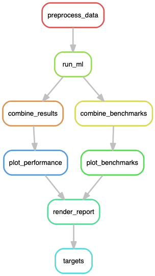
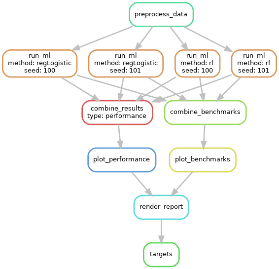

# Running mikropml with snakemake

[Snakemake](https://snakemake.readthedocs.io/en/stable) is a workflow manager
that enables massively parallel and reproducible
analyses.
Snakemake is a suitable tool to use when you can break a workflow down into
discrete steps, with each step having input and output files.

[mikropml](http://www.schlosslab.org/mikropml/) is an R package for robust machine learning pipelines.
We provide this example workflow as a template to get started running mikropml with snakemake.
We hope you then customize the code to meet the needs of your particular ML task.

For more details on these tools, see the
[Snakemake tutorial](https://snakemake.readthedocs.io/en/stable/tutorial/tutorial.html)
and read the [mikropml docs](http://www.schlosslab.org/mikropml/).

## The Workflow

The [`Snakefile`](Snakefile) contains rules which define the output files we want and how to make them.
Snakemake automatically builds a directed acyclic graph (DAG) of jobs to figure
out the dependencies of each of the rules and what order to run them in.
This workflow preprocesses the example dataset, calls `mikropml::run_ml()`
for each seed and ML method set in the config file,
combines the results files, plots performance results,
and renders a simple [R Markdown report](report.Rmd) as a GitHub-flavored [markdown file](report.md).



The DAG shows how calls to `run_ml` can run in parallel if
snakemake is allowed to run more than one job at a time.
If we use 100 seeds and 4 ML methods, snakemake would call `run_ml` 400 times.
Here's a small example DAG if we were to use only 2 seeds and 2 ML methods:




## Quick Start

1. Clone or download this repo and go to the directory.

    ``` sh
    git clone https://github.com/SchlossLab/mikropml-snakemake-workflow
    cd mikropml-snakemake-workflow
    ```

    Alternatively, if you're viewing this on GitHub,
    you can click the green `Use this template` button to create
    your own version of the repo on GitHub, then clone it.

1. Create a conda environment and activate it.

    ``` sh
    conda env create -f config/environment.yml
    conda activate smk-ML
    ```
    (Recommend [miniconda](https://docs.conda.io/en/latest/miniconda.html)
    if you don't already have conda installed.)

    Alternatively, you can install the dependencies listed in
    [`config/environment.yml`](config/environment.yml) however you like.

1. Edit the configuration file [`config/config.yml`](config/config.yml).
    - `dataset`: the path to the dataset as a csv file.
    - `outcome_colname`: column name of the outcomes for the dataset.
    - `ml_methods`: list of machine learning methods to use. Must be supported by mikropml.
    - `kfold`: k number for k-fold cross validation during model training.
    - `ncores`: the number of cores to use for preprocessing and for each `mikropml::run_ml()` call. Do not exceed the number of cores you have available.
    - `nseeds`: the number of different random seeds to use for training models with `mikropml::run_ml()`.

    You can leave these options as-is if you'd like to first make sure the
    workflow runs without error on your machine before using your own dataset
    and custom parameters.

    The default config file is suitable for initial testing,
    but we recommend using more cores if available and
    more seeds for model training.
    A more robust configuration is provided in
    [`config/config_robust.yml`](config/config_robust.yml).

1. Do a dry run to make sure the snakemake workflow is valid.

    ``` sh
    snakemake -n
    ```

1. Run the workflow.

    Run it **locally** with:
    ``` sh
    snakemake
    ```

    Or specify a different config file with:
    ``` sh
    snakemake --configfile config/config_robust.yml
    ```

    To run the workflow on an **HPC with Slurm**:

    1. Edit your email (`YOUR_EMAIL_HERE`), Slurm account (`YOUR_ACCOUNT_HERE`), and other Slurm parameters as needed in:

        - [`code/submit_slurm.sh`](code/submit_slurm.sh)
        - [`config/cluster.json`](config/cluster.json)

    1. Submit the snakemake workflow with:

        ``` sh
        sbatch code/submit_slurm.sh
        ```

        The main job will then submit all other snakemake jobs, allowing
        independent steps of the workflow to run on different nodes in parallel.
        Slurm output files will be written to `log/hpc/`.

1. View the results in [`report.md`](report.md).

    This example report was created by running the workflow on the Great Lakes HPC
    at the University of Michigan with [`config/config_robust.yml`](config/config_robust.yml).

## More resources

- [mikropml docs](http://www.schlosslab.org/mikropml/)
- [Snakemake tutorial](https://snakemake.readthedocs.io/en/stable/tutorial/tutorial.html)
- [conda user guide](https://docs.conda.io/projects/conda/en/latest/user-guide/getting-started.html)
